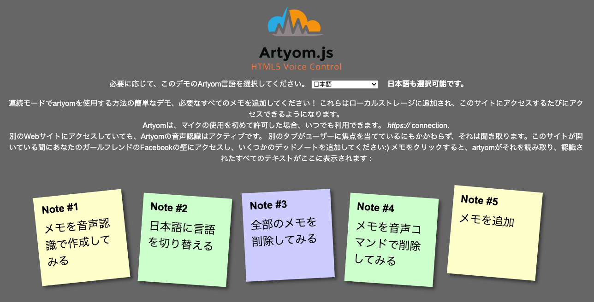
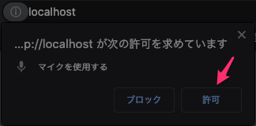

# artyom.js - todo list.
A sample application that allows you to add and delete a toDo list with voice control using Artyom.js. Japanese compatible.

## About
artyom.js を使ったボイスコントールで、ToDoリストを追加、削除できるサンプルアプリケーション。日本語対応。



## How to use.
このサンプルプログラムを起動するには、以下のようにしてください。
#### (1) Git Clone.

ローカルにWEBを起動して、webrootにこのリポジトリを出します。
```
git clone https://github.com/take-i/artyom-todo.git
```

#### (2) Chrome ブラウザでアクセス

初回アクセス時には、「マイクの使用許可」の権限設定が出ます。許可を押してください。


#### (3) マイクに向かってコマンドを話す

| ボイスコマンド（日本語の場合） | 詳細                                                         |
| ---------------------------------------- | ------------------------------------------------------------ |
| *メモ作成                                | あなたの声でノートの作成をトリガーしてください！  コマンドを発声し、*をメモの内容に置き換えます。     例: 今度の土曜日は映画に行く　メモ作成 |
| *番目のメモを削除                        | 識別された番号のメモを削除してください！  *を既存のノートの番号に置き換えます     例 : 1番目のメモを削除 |
| 全部消して                               | ドキュメントに保存されているすべてのメモを削除します         |